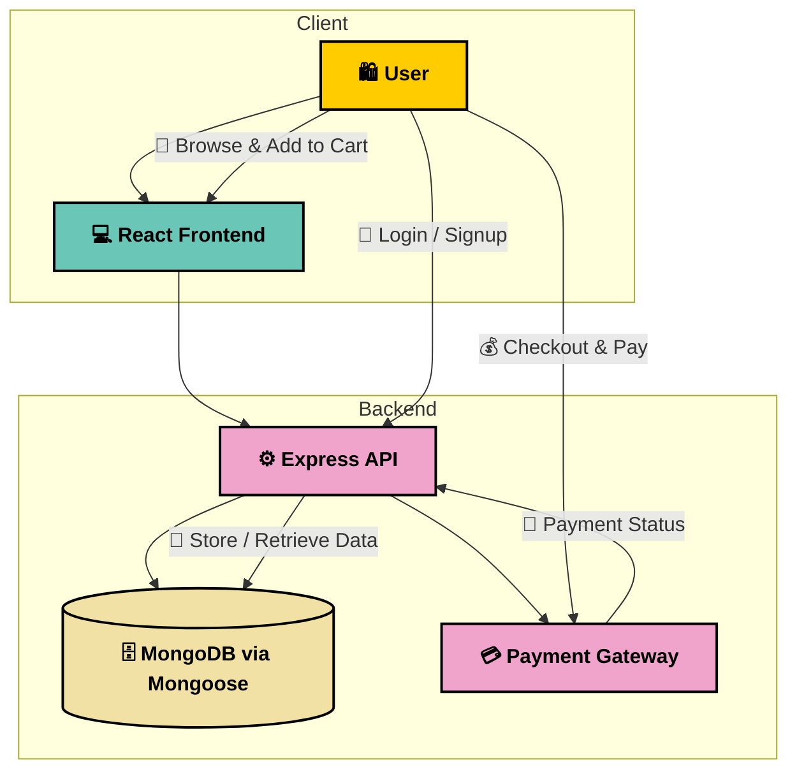

# 🛒 E-Commerce Platform


---

## 📖 About The Project

**E-Commerce Platform** is a modern full-stack web application built for **online shopping**.  
It allows customers to **browse products, add to cart, and place secure orders**, while admins can **manage inventory, users, and transactions**.

This project was built with **React, Node.js, Express, MongoDB, and TailwindCSS** for scalability, speed, and flexibility.

---

## ✨ Key Features

- 👤 **User Authentication** – Secure login and signup.
- 🛍 **Product Management** – Browse, search, and filter products.
- 🛒 **Cart & Checkout** – Add to cart, update, and place orders.
- 💳 **Payments** – Integrated with secure payment gateways.
- 📦 **Order Tracking** – Track your purchases in real-time.
- 🛠 **Admin Dashboard** – Manage users, products, and orders.
- ⚡ **Fast & Responsive** – Optimized with **React + TailwindCSS**.

---


## 📁 Directory Structure

The project is organized as follows:

```
Directory structure:
└──  e-commerce/
    ├── LICENSE
    ├── client/
    │   ├── package.json
    │   ├── tailwind.config.js
    │   ├── public/
    │   │   ├── index.html
    │   │   ├── manifest.json
    │   │   └── robots.txt
    │   └── src/
    │       ├── App.js
    │       ├── App.test.js
    │       ├── index.css
    │       ├── index.js
    │       ├── reportWebVitals.js
    │       ├── setupTests.js
    │       ├── app/
    │       │   ├── constants.js
    │       │   └── store.js
    │       ├── features/
    │       │   ├── admin/
    │       │   │   └── components/
    │       │   │       ├── AdminOrderDetail.js
    │       │   │       ├── AdminOrders.js
    │       │   │       ├── AdminProductDetail.js
    │       │   │       ├── AdminProductList.js
    │       │   │       └── ProductForm.js
    │       │   ├── auth/
    │       │   │   ├── authAPI.js
    │       │   │   ├── authSlice.js
    │       │   │   └── components/
    │       │   │       ├── ForgotPassword.js
    │       │   │       ├── Login.js
    │       │   │       ├── Logout.js
    │       │   │       ├── Protected.js
    │       │   │       ├── ProtectedAdmin.js
    │       │   │       ├── ResetPassword.js
    │       │   │       └── Signup.js
    │       │   ├── brands/
    │       │   │   ├── brandsAPI.js
    │       │   │   └── brandSlice.js
    │       │   ├── cart/
    │       │   │   ├── Cart.js
    │       │   │   ├── cartAPI.js
    │       │   │   └── cartSlice.js
    │       │   ├── category/
    │       │   │   ├── categoryAPI.js
    │       │   │   └── categorySlice.js
    │       │   ├── common/
    │       │   │   └── components/
    │       │   │       ├── Footer.js
    │       │   │       ├── Modal.js
    │       │   │       └── Pagination.js
    │       │   ├── navbar/
    │       │   │   └── Navbar.js
    │       │   ├── order/
    │       │   │   ├── orderAPI.js
    │       │   │   └── orderSlice.js
    │       │   ├── payment/
    │       │   │   ├── paymentAPI.js
    │       │   │   └── paymentSlice.js
    │       │   ├── product/
    │       │   │   ├── productAPI.js
    │       │   │   ├── productSlice.js
    │       │   │   └── components/
    │       │   │       ├── ProductDetail.js
    │       │   │       └── ProductList.js
    │       │   └── user/
    │       │       ├── userAPI.js
    │       │       ├── userSlice.js
    │       │       └── components/
    │       │           ├── UserOrders.js
    │       │           └── UserProfile.js
    │       └── pages/
    │           ├── 404.js
    │           ├── AdminHome.js
    │           ├── AdminOrderDetailPage.js
    │           ├── AdminOrdersPage.js
    │           ├── AdminProductDetailPage.js
    │           ├── AdminProductFormPage.js
    │           ├── CartPage.js
    │           ├── Checkout.js
    │           ├── ForgotPasswordPage.js
    │           ├── Home.js
    │           ├── LoginPage.js
    │           ├── OrderSuccessPage.js
    │           ├── ProductDetailPage.js
    │           ├── ResetPasswordPage.js
    │           ├── SignupPage.js
    │           ├── UserOrdersPage.js
    │           └── UserProfilePage.js
    └── server/
        ├── index.js
        ├── package.json
        ├── pnpm-lock.yaml
        ├── .env.sample
        ├── controllers/
        │   ├── Auth.Controller.js
        │   ├── Brand.Controller.js
        │   ├── Cart.Controller.js
        │   ├── Category.Controller.js
        │   ├── Mail.Controller.js
        │   ├── Order.Controller.js
        │   ├── Payment.Controller.js
        │   ├── Product.Controller.js
        │   └── User.Controller.js
        ├── models/
        │   ├── Brand.Model.js
        │   ├── Cart.Model.js
        │   ├── Category.Model.js
        │   ├── Order.Model.js
        │   ├── Payment.Model.js
        │   ├── Product.Model.js
        │   └── User.Model.js
        ├── routes/
        │   ├── Auth.Routes.js
        │   ├── Brand.Routes.js
        │   ├── Cart.Routes.js
        │   ├── Category.Routes.js
        │   ├── Mail.Routes.js
        │   ├── Order.Routes.js
        │   ├── Payment.Routes.js
        │   ├── Product.Routes.js
        │   └── User.Routes.js
        ├── services/
        │   ├── Common.js
        │   └── Mails/
        │       ├── ConfirmationMail.js
        │       ├── ResetMail.js
        │       ├── SendEMail.js
        │       └── WelcomMail.js
        └── utils/
            └── connectDB.js

```

### Key Folders and Files:

- **/client**: React frontend for UI/UX.
- **/client/components**: Reusable UI components (Navbar, Footer, ProductCard, etc.).
- **/client/pages**: Main pages like Home, Cart, Checkout, and Product details.
- **/client/services**: API service layer for client-server communication.
- **/server**: Express backend handling routes, controllers, and database logic.
- **/server/models**: MongoDB models for Users, Products, and Orders.
- **/server/controllers**: Business logic for authentication, orders, and product management.
- **/server/routes**: REST API endpoints for client interactions.

---

## 🏗️ Architecture

The system architecture is built to ensure **performance, scalability, and modularity**. It follows a **client-server model** with separate frontend and backend responsibilities:

- **Frontend (React + TailwindCSS):** Handles product browsing, cart management, and checkout flow.
- **Backend (Node.js + Express):** Provides REST APIs for users, products, and orders.
- **Database (MongoDB + Mongoose):** Stores user accounts, products, orders, and transactions.
- **Authentication (JWT):** Secure login and protected routes for users and admins.
- **Payments (Payment Gateway):** Secure payment processing for orders.



---

## 🛠 Built With

- **Frontend:** React, TailwindCSS
- **Backend:** Node.js, Express
- **Database:** MongoDB, Mongoose
- **Auth:** JWT
- **Payments:** Payment Gateway (e.g., Stripe/PayPal)

---

## ⚙️ Getting Started

### Prerequisites

- Node.js 18+
- MongoDB instance
- Payment Gateway API Keys (Stripe/PayPal)

### Installation

```bash
git clone https://github.com/username/be-a-guptaji-e-commerce.git
cd be-a-guptaji-e-commerce
```

#### Install client dependencies:
```bash
cd client
npm install
```

#### Install server dependencies:
```bash
cd ../server
npm install
```

### Configuration

Create `.env` in the `server/` directory and add:

```env
MONGO_URI=your_mongo_connection_string
JWT_SECRET=your_jwt_secret
PAYMENT_GATEWAY_KEY=your_payment_key
```

### Run Development Server

Start backend:
```bash
cd server
npm run dev
```

Start frontend:
```bash
cd client
npm start
```

Visit 👉 [http://localhost:3000](http://localhost:3000)

---

## 🛣️ Roadmap

- [x] User Authentication (JWT)
- [x] Product Management
- [x] Cart & Checkout
- [x] Order Tracking
- [ ] Email Notifications
- [ ] Admin Analytics Dashboard
- [ ] Multi-language Support

---

## 📜 License

MIT License © 2025 Aryan Baadlas

---

## 📬 Contact

👨‍💻 **Aryan Baadlas**  
📧 **aryanbaadlas@gmail.com**

---

### ⭐ Show some love!

If you like this project, **give it a star ⭐ on GitHub**!
